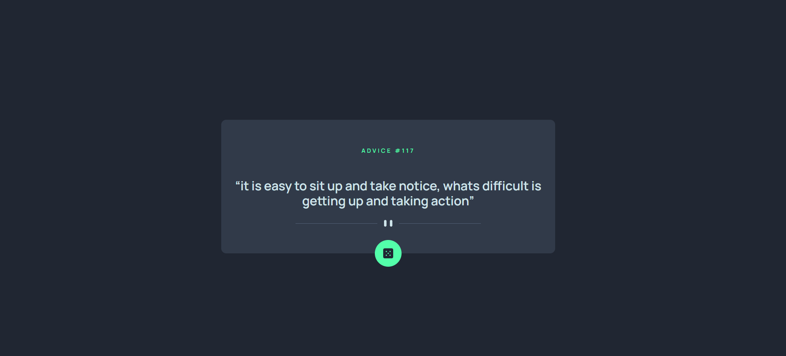

# Frontend Mentor - Advice generator app solution

This is a solution to the [Advice generator app challenge on Frontend Mentor](https://www.frontendmentor.io/challenges/advice-generator-app-QdUG-13db). Frontend Mentor challenges help you improve your coding skills by building realistic projects.

## Table of contents
  - [The challenge](#the-challenge)
  - [Screenshot](#screenshot)
  - [Links](#links)
  - [Built with](#built-with)
  - [Useful resources](#useful-resources)
- [Author](#author)

### The challenge

Users should be able to:
- View the optimal layout for the app depending on their device's screen size
- See hover states for all interactive elements on the page
- Generate a new piece of advice by clicking the dice icon

### Screenshot

### Links

- Solution URL: [solution URL Github](https://github.com/MohammadSoleimanikia/advice-generator-app)
- Live Site URL: [live site URL](https://mohammadsoleimanikia.github.io/advice-generator-app/)

### Built with

- Semantic HTML5 markup
- CSS custom properties
- Flexbox
- Mobile-first workflow
-Java Script
-tailwind

### Useful resources

- [lord icon](https://lordicon.com/icons) -i used the spin animated icon from lord icon
## Author

- Git Hub - [Mohammad Soleimanikia](https://github.com/MohammadSoleimanikia)
- Frontend Mentor - [@MohammadSoleimanikia](https://www.frontendmentor.io/profile/MohammadSoleimanikia)